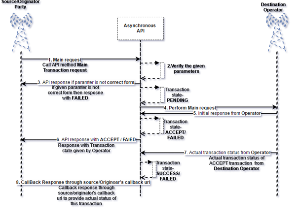

  

<b>Asynchronous/Synchronous: </b>In computer programs, asynchronous operation means that a process operates independently of other processes, whereas synchronous operation means that the process runs only as a result of some other process being completed or handing off operation.

Synchronous API is not always suitable during multi-party involvement during request/response cycle. Source/Originator could not get the actual status of each request synchronously. Because final status of each request will depend with status of each party present at Destination side. At this case Asynchronous communication mechanism should be applied in central API to handle different type of transition status based on different states. 

There will be possible three API states based on above image:

1) After request initiates form Source/Originator (<b>in image step 2</b>).

2) Verify and API response with acknowledgement (<b>in image step 3 or 6</b>)

3) Actual Success or Failed response through Source/Originator platform’s call back URL (<b>in mage step 8</b>).

